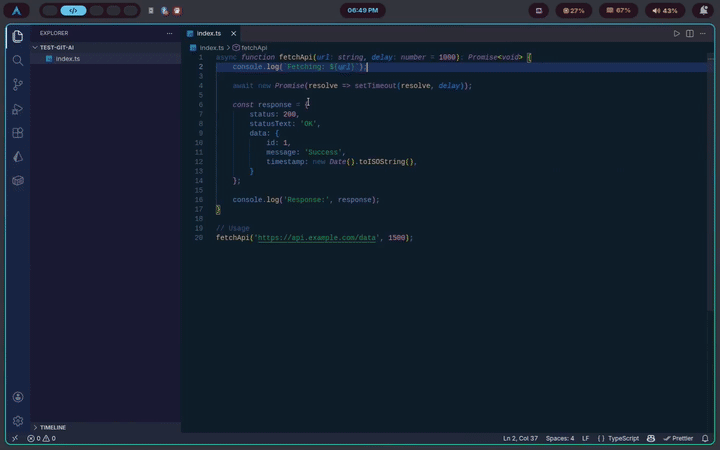

# git-commit-msg

A CLI tool that generates git commit messages using **Gemini AI** — works in any editor, plays nicely with Husky.

---

## The Problem

- Writing commit messages manually is tedious
- VS Code Copilot breaks when Husky pre-commit hooks run
- Switching to VS Code just for a commit message when using Vim/Sublime is annoying

## The Solution

`git-commit-msg` reads your staged diff, sends it to Gemini 2.5 Flash, and gives you a generated commit message you can confirm or edit — right in the terminal.

---

## Demo



---

## Installation

> **Requirements:** Node.js >= 18, pnpm, Git

### Build from source

```bash
git clone https://github.com/subratamondal1029/git-commit-msg.git
cd git-commit-msg
cp .env.example .env
```

Open `.env` and add your Gemini API key:

```env
GEMINI_API_KEY=your_api_key_here
```

> Get a free API key at [aistudio.google.com](https://aistudio.google.com)

```bash
pnpm i
pnpm build
pnpm link --global
```

> If `pnpm link` fails, run `pnpm setup` first, restart your terminal, then try again.

---

## Usage

### Option 1 — Run directly

```bash
git add <files>
git-commit-msg
```

### Option 2 — Set as a git alias

```bash
git config --global alias.commit-ai '!git-commit-msg'
```

Then use it like a native git command:

```bash
git add <files>
git commit-ai
```

---

## Why it works with Husky

Unlike editor-based tools, `git-commit-msg` runs in the terminal — completely outside the editor. Husky pre-commit hooks run their checks normally. No conflicts.

---

## License

MIT — [Subrata Mondal](https://subratamondal.vercel.app)